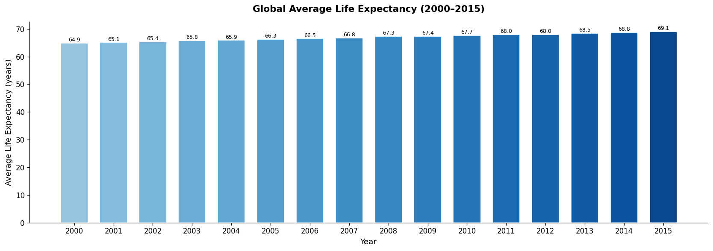
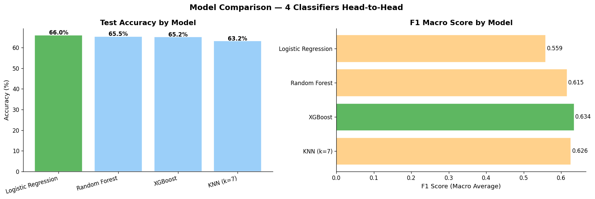
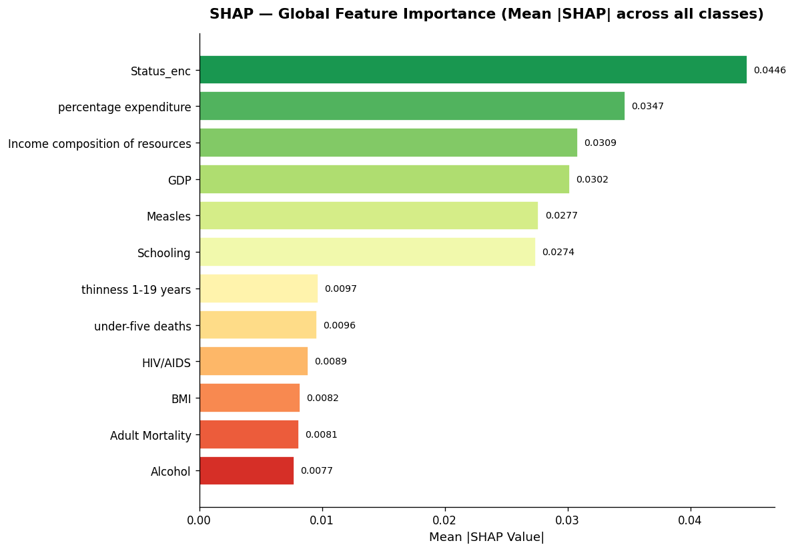

# 🌍 Global Health & Life Expectancy Analysis + ML Prediction

> End-to-end Data Science project on WHO Life Expectancy data  
> 112 countries · 16 years (2000–2015) · 1792 records · 16 visualisations

---

## 📌 Problem Statement
As a data scientist at a global health insurance firm, identify trends
in life expectancy, determine the key health/economic drivers, and build
an ML pipeline to classify countries into Low / Medium / High life
expectancy tiers for insurance premium modelling.

---

## 🛠️ Tech Stack

| Category | Libraries |
|---|---|
| Data | NumPy, Pandas |
| Visualisation | Matplotlib, Seaborn, Plotly |
| Statistics | SciPy (t-test, Z-score, CDF) |
| Machine Learning | Scikit-Learn, XGBoost |
| Explainability | SHAP |
| Forecasting | Prophet |

---

## 📂 Project Structure

| Section | Description |
|---|---|
| 1 | Imports & Configuration |
| 2 | Data Loading & Inspection |
| 3 | Cleaning, Imputation & Feature Engineering |
| 4 | Exploratory Data Analysis (5 plots) |
| 5 | Statistical Analysis — Welch's t-test, Z-score, CDF |
| 6 | Correlation Heatmap & Feature Analysis |
| 7 | Baseline Random Forest Classifier |
| 8 | Random Forest Regressor (predict exact LE value) |
| 9 | Model Comparison — LogReg vs KNN vs RF vs XGBoost |
| 10 | Hyperparameter Tuning — GridSearchCV |
| 11 | Production sklearn Pipeline |
| 12 | SHAP Explainability (Global + Local Waterfall) |
| 13 | Time-Series Forecasting — Facebook Prophet |
| 14 | Interactive Plotly Dashboard (HTML) |
| 15 | Insights & Conclusions |

---

## 📊 Key Results

- Global life expectancy rose **+4.2 years** from 2000 to 2015
- Developed vs Developing gap = **16.9 years** (p ≈ 0, statistically significant)
- **21.6%** of developing countries had life expectancy below 60 in 2015
- RF Regressor: **R² = 0.52**, MAE = **5.63 years**
- Best classifier: **Logistic Regression** (66% accuracy)
- SHAP top features: **Status, GDP, Schooling, Income composition**
- Prophet forecast: Developing countries → **69.4 yrs by 2025**

---

## 🚀 How to Run

```bash
# Install dependencies
pip install numpy pandas matplotlib seaborn scipy scikit-learn xgboost shap plotly prophet

# Run the project
python global_health_advanced_v2.py
```

Or open directly in Google Colab:  
[](https://colab.research.google.com/)

---

## 📈 Sample Visualisations





---

*Built by Lakshya | B.Tech ECE, Manipal University Jaipur*
